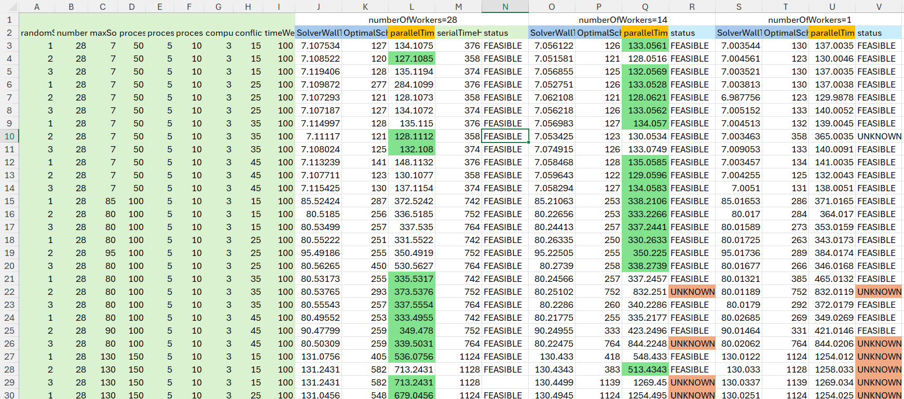

# ConThereum: Google OR-Tools Implementation

## Project Overview
ConThereum’s Google OR-Tools implementation explores combinatorial optimization methods to minimize execution time and manage process conflicts in EVM. This approach improves the scheduling of Ethereum transactions across multiple resources.

This project is part of the ConThereum initiative, which explores transaction optimization techniques for Ethereum Virtual Machine (EVM) environments. This implementation utilizes **Google OR-Tools** to achieve efficient scheduling of processes across multiple computing resources. This project is a Maven-based Java application. It contains a main class, `Main.java`, to execute the benchmarks.

## License
This project is licensed under the MIT License.

## Prerequisites

- **Java 17** or higher
- **Apache Maven** (latest recommended)

## Project Structure

- **Folder:** `concurrent-evm/OR-Tool`
- **Main Java Class Path:** `concurrent-evm/OR-Tool/src/main/java/emvScheduling/application/Main.java`

- (will be completed later)

## Setup Instructions

1. Clone this repository:
   (The link has been temporarily omitted from this initial submission to maintain the integrity of the blind review process.)

   ```bash
   git clone <repository-url> 
   ```

2. Install the 'Greedy' project:
The OR-Tool project is dependant to Greedy project to improve its speed, so initially install Greedy project using 
   the following command:
   ```bash
   cd concurrent-evm/Greedy
   mvn clean install
   ```

3. Ensure all dependencies are installed by running
   ```bash
   cd concurrent-evm/OR-Tool
   mvn clean install 
   ```

4. Running the Main Class and Passing Its Parameters

To run the Main class, you need to pass a list of nine numbers as parameters in the following order:

### Execution Environment Settings:
- **randomSeed**: The random seed to reproduce the scheduling problem specification with determinism and absence of any randomization. It is used to generate the process execution time and produce the conflicting processes.
- **numberOfWorkers**: The number of threads that execute this program.
- **maxSolverExecutionTimeInSeconds**: Execution time for the solver to produce the best possible solution during that time.

### Scheduling Problem Facts:
- **processCount**: The number of processes.
- **processExecutionTimeMin**: The minimum time each process will take.
- **processExecutionTimeMax**: The maximum time that a process will take.
- **computerCount**: The number of computers available.
- **conflictPercentage**: The percentage of conflicts among processes.
- **timeWeight**: The weight assigned to time in the calculations.

**Note:** The execution time for each process will be a random value greater than or equal to `processExecutionTimeMin` and less than or equal to `processExecutionTimeMax`. If you want all processes to have the same execution time, set both `processExecutionTimeMin` and `processExecutionTimeMax` to that desired value.

There are two options to execute the program: `args` and `files`. Examples for executing the program using each option are provided below.

### args

Pattern:

   ```bash
   mvn exec:java -Dexec.args="args randomSeed numberOfWorkers maxSolverExecutionTimeInSeconds processCount processExecutionTimeMin processExecutionTimeMax computerCount conflictPercentage timeWeight"
   ```

Example:

   ```bash
   mvn exec:java -Dexec.args="args 0 8 20 60 5 5 3 15 100"
   ```
- **Usage:** This option is the preferred approach for a quick test on a single sample.
- **Input:** The nine explained numbers is specified in the command 
- **Output:** Results are displayed on the command prompt and appended to the end of the file 
  `src/java/resources/output-accumulative.csv` too. The detailed output items are explained in the [Output Structure](#Output-structure)

### files
   ```bash
   mvn exec:java -Dexec.args="files"
   ```
- **Usage:** This option is preferred for batch execution of the solver over a dataset.


- **Input:** The input file `src/java/resources/input.csv` includes a header row and data rows, each containing the 
  following items in order. The first two items (**no**, **groupNo**), are used solely for organizational purposes 
  (item number and group number) and do not contribute to any calculations. The remaining items are explained earlier in 
  this document.
  
  **no**, **groupNo**, randomSeed, numberOfWorkers, maxSolverExecutionTimeInSeconds, processCount, 
    processExecutionTimeMin, processExecutionTimeMax, computerCount, conflictPercentage, timeWeight


- **Output:** The output file `src/java/resources/output.csv` is generated. For each row in the input, a 
  corresponding row in the output contains the nine input items along with the output items. Additionally, the 
  results are appended to `src/java/resources/output-accumulative.csv`, which accumulates the results of all 
  executions (both `args` and `files`).  The detailed output items are explained in the [Output Structure](#Output-structure)  


## Output Structure

The output produced by the 'args' option on the command line and the output in both output files `src/java/resources/output.csv` and `src/java/resources/output-accumulative.csv` have the same format and order as follows:

`no, groupNo, randomSeed, numberOfWorkers, maxSolverExecutionTimeInSeconds, processCount, processExecutionTimeMin, 
processExecutionTimeMax, computerCount, conflictPercentage, timeWeight, SolverWallTime, makespan, 
parallelTimeSum, serialTimeHorizon, solverStatus`

The first non-bold items are repetitions of the input file to distinguish the input for the execution. The bold values are the results of the executions and are explained below:

- **SolverWallTime**: The time the solver uses to find the result.
- **makespan**: The optimal or suboptimal schedule time found by the solver for executing processes in parallel.
- **parallelTimeSum**: The summation of the last two numbers (SolverWallTime + makespan), representing the practical time it will take for the processes to be executed using this scheduler in parallel.
- **serialTimeHorizon**: The time it will take if we execute all processes sequentially.
- **solverStatus**: The status of the solver, which can be either "OPTIMAL" or "FEASIBLE."


## Optimizing Hint and Experiments 
## 1- Optimizing The Input Variables Value

To determine the best values for the aforementioned variables to minimize the `parallelTimeSum` as much as possible, consider the following suggestions:

### **1-1- processCount**:

There are two approaches to deciding the best value for `processCount`:
- **1-1-1- value of one: ** In the first approach, the best value for `processCount` is suggested as `1`. 
  - Our tests show that this tends to lead to a negligible improved value for `SolverWallTime` in most cases, but it 
    made `makespan` worst. Consequently `parallelTimeSum` get worst. 
- **1-1-2- value of core count:** In the second approach, the number of actual cores in the test environment is suggested 
  for use. Our test shows slightly better `SolverWallTime` while using the actual cores instead of logicalCores. However, our tests show 
  that this value is not necessarily the optimal one, but generally end to the best `parallelTimeSum`. We recommend 
  considering it, but it does not guarantee the best result.
    - In Microsoft Windows, this can be determined by running the following command in the Command Prompt:
       ```bash
       wmic CPU get NumberOfCores,NumberOfLogicalProcessors
       ```
      Example output:
       ```
       NumberOfCores   NumberOfLogicalProcessors
       4               8
       ```
      In this case, the best value for `processCount` is `4`.

    - In Linux, the equivalent command is:
      ```bash
      echo "Logical Cores: $(grep -c '^processor' /proc/cpuinfo), Physical Cores: $(grep 'core id' /proc/cpuinfo | sort -u | wc -l)"
      ```
      Example output:
       ```
      Logical Cores: 28, Physical Cores: 14
       ```
  
Based on our experiments showing on the following picture, while using number one for this variable made a 
negligible improvements for `SolverWallTime` (they are all almost equal to `maxSolverExecutionTimeInSeconds`) but 
increased significantly `makespan` and consequently `parallelTimeSum` and also with equal value of 
`maxSolverExecutionTimeInSeconds`, for the last 5 rows, by changing the value of `processCount` from `NumberOfCores` 
to `1` the result changed from `FEASIBLE` to `UNKNOWN` that is sensible and means for those problems in the given 
time by utilizing the maximum cores, a feasible answer is found while by utilizing a single core, no feasible answer 
could be found in that given time. 

**Actual Core vs Virtual Core:**
Considering the following experiments, the best choice is virtual core count instead of actual core counts, while 
the final time is better in each at times, the use of virtual core count did not end to `UNKNOWN` results even in 
the bigger models while the other one did.



To determine how `processCount` reduces `SolverWallTime`, please note that to test
the best value for this variable, you need to design a scenario that results in an `Optimal` solution and then
check its `SolverWallTime`. Otherwise, if the solution is `FEASIBLE`, the `SolverWallTime` will almost equal
`maxSolverExecutionTimeInSeconds`.

## 2- Optimizing The Code Level Settings
Please refer to EmvBalanceSolver.java and review all the matching lines of `solver.getParameters().set...` for 
different configurations and their results on the performance, including the following:

//solver.getParameters().setCpModelPresolve(true);// false: make the "makespan" the way worst
* //solver.getParameters().setUsePrecedencesInDisjunctiveConstraint(true); // deteriorated the performance
* solver.getParameters().setSearchBranching(SatParameters.SearchBranching.PORTFOLIO_SEARCH);  // Made the performance 
  better when there was no conflict
* //solver.getParameters().setSymmetryLevel(2); // better performance in absence of it
* // solver.getParameters().setSearchBranching(SatParameters.SearchBranching.FIXED_SEARCH);//improves the
  // performance in absence of conflicts (using this line, all the processes starts from zero but in absence of
  // it they don't start from zero even though there would be no conflict) but deteriorate in presence of
  // conflicting processes
* solver.getParameters().setRandomizeSearch(true);// Enable randomization and improve the wall time for optimal solutions
* solver.getParameters().setUseLns(true);// Enable large neighborhood search
* solver.getParameters().setUseLns(true);// Enable large neighborhood search: by using false value the wall time
  // of optimal answers are getting better and worst at times and the feasible answer for a given time is the
  // same for cases and needs further test to be decided.

## Contact
For questions or contributions, please contact the project maintainer.

(The link has been temporarily omitted from this initial submission to maintain the integrity of the blind review process.)
